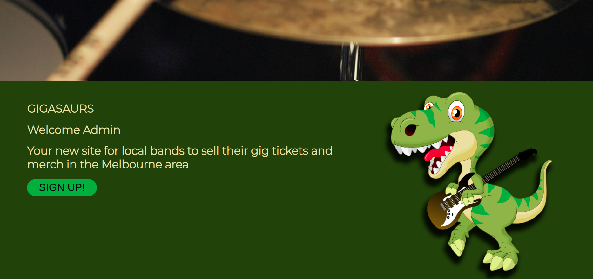

<div style="text-align: justify; font-size: 1.5em">

# Identification of the problem.

**Gigasaurs** is a two sided marketplace where local and indie bands can sell their tickets online.

For many years I used to play in a progressive metal band. We played many shows around the Melbourne area. Most of the gigs you’d play for free, for exposure as they called it. But some times you’d get the big support gigs. There was a show when we supported *‘The Butterfly Effect’*, but the deal was that we needed to sell 100 tickets. In those days, you had to call friends and pled with them to buy tickets in order to support you. I wanted to create a marketplace app that allowed bands to easily sell tickets to their shows and for users to buy tickets to the shows.

# Why is it a problem that needs solving?

Of course, there are online ticketing sites such as Ticketek and Ticketmaster that sell tickets to large international bands concert and events, but nothing that is local. A local band that is playing at *Sooki Lounge* in Belgrave can log on, create an account and sell their tickets to their event. Most small indie bands have a small following so something like **Gigasaurs** can provide a way to network to music lovers or sell to life long fans.

In Australia, the current gig situation is that a promoter will be in charge of running an event. They may contact a venue and ask if they can run an event. The venue says *‘yes’* and then the promoter hunts down bands suitable for the venue and the event. Once a band has agreed to playing, the promoter usually gets them to sell the tickets. This is where it falls apart. The band is then forced to sell tickets.

There has been many times where the promoter has rang me up daily, asking *“how many tickets have you sold today!”*. Previously there wasn’t a system where we could sell them online. But with **Gigasaurs**, bands can log in, sell tickets and public can support the local live music scene.

**Gigasaurs** doesn’t only benefit bands, as eventually I would like to include a search feature where general music fans can search for their favorite music styles or venues nearby, to find exciting and new music.

# Website

https://gigasaurs.herokuapp.com/

# Github repo

https://github.com/DannyField/Gigasaurs

# Purpose

The purpose of **Gigasaurs** is for local Independent bands and artists to sell their tickets (and eventually merch) online. This allows fans or general users to purchase tickets or merch from the bands. A general user of the site can sign up and see the latest gig listing, buy tickets and support the local music scene.

I wanted to create a Ruby on Rails application that gave local bands a chance to sell tickets to a wider community.

# Functionality and Features

Features include logging in and signing up. A profile page for each user with the ability to add a profile picture. The user can create a band profile page and create gigs. They can also add other users to the band page. The band through the gig page is then able to sell tickets, and can be purchase with the use of stripe.

Features coming soon include selling of merch, more robust profile pages where bands can add links to their Spotify and Youtube. Blog posts for users and bands. Message system that allows interaction between a band and its fan. A search engine that allows a user to search by location, music style, or band.

# Sitemap


# Screenshots





# Target Audience

The target audience is fans of local music in general, bands trying to sell their tickets to shows, and the local music industry in general. **Gigasaurs** allows the general public to support local bands and buy tickets to shows, as well as supporting the local bands by giving them a platform to sell tickets on. It also helps the venues and promoters as they are able to track how well the tickets sales are going. No more hassling the bands. The venue management can also see how busy the night could be.

# Tech Stack

- Ruby on Rails v6.0.3
- Ruby v2.7.0
- Git and GitHub
- Postgresql
- Slack
- Pivotal Tracker
- Amazon AWS, S3
- Sass / CSS
- HTML5
- ERB
- Postgresql

Ruby on Rails v6.0.3 was used for the creation of this application. It is a web-application framework that helps create a Model-View-Controller system.

ERB which is a variation of HTML was used for the views. More commonly known as Embedded Ruby which is HTML with embedded Ruby

SCSS was used for styling the views. SCSS is a superset of CSS.

Postgresql was the database for choice.

# User Stories

###### Greg, 28 from Brunswick

> As a user, I can log on and discover locals gigs and bands in my area. If my friends, who are in a band, are playing at an event, then I can easily purchase tickets through **Gigasaurs**. I can even buy their merch on sale!

###### Blark Maximus, 36, from the band Puppy Grinder

> As a band, we can sell merch and gig tickets to our family and friends, and heck, might even discover some new fans along the way. We get the money instantly through stripe and know how many tickets are left. Now no more unhappy promoters!!

###### Fat Tony, 54, owner of the King of Wales Pub

> As an owner of a pub, I can track and see how well a band is doing in ticket sales. I can see the tickets sold and whether we will have a busy night selling heaps of beers! People can also search by venue, which helps promote us as well.

###### Dave, 28, from Five Star Promotions and Events

> As a promoter I can check whether a band is performing well in ticket sales. I can even check how other venues are performing for possible future events.

###### Joe, 54, from We-Promote-You

> As an advertising and marketing firm I can see which local bands are performing well and target those bands for future promotional content.

###### Jason, 19, from band 'My Fever Dream'

> As a new starting out band I can see whether another local bands would be suitable for supporting us at a gig. Or whether a venue would be suitable for us to perform at, due to past ticket sales and reactions.

# Wireframes

Originally I wanted a lot of interactive with the site. The color scheme came later on in the project, and even now, I'm thinking of changing it!


# ERD


# The high-level components in the app

Three examples of high level components are as follows:

- Active Record
- Active Storage
- Action View
- Active Model

Active Record is considered the model in an MVC application. It is a module built within the base class of Rails and lets us interact with a database. It is classed as having a technique called Object Relational Mapping, where relationships and properties of objects within an application can have CRUD abilities. Active Record looks after the CRUD function of data stored in the database. Despite it being written in Ruby, it is able to communicate with SQL databases without having to write SQL statements. Active Record also handles your schema and migrations allowing you to modify your database. Active Record will update your schema file to match the structure of your database. Active Record also uses some clever naming conventions to work out the mapping between the models and the databases. As Rails is known for ‘Convention over Configuration’, Active Record knows how to classify database tables by either pluralizing or singular regular words.

Active Storage helps the process of uploading content to cloud based services such as Google Cloud, Amazon S3 and linking those files to Active Record objects. There is also a local Active Storage service that is used for the testing and development stages. Once Active Storage is installed, it was generate a table for the database, where the Active Record will handle the migration and populate entries into the schema. String entries such as filename, content_type, metadata, byte_size and checksum will be included in the database. From here, adding the cloud based service is needed in the config/storage.yml file. Attaching files to the Active Record is by the ‘has_one_attached’ or ‘has_many_attached’ macros. It allows the end user to be able to upload content via the application.

Action View is one part of the task force for web requests. The other being Action Controller. While Action Controller deals with the models and database, Action View handles the view that is rendered back to the screen. It also contains some handy helper method classes, such as FormHelper; that works with the model attributes, and strips back a lot of what was previously needing to be done when creating a form. It provides common behaviors for dates, strings and forms. A final HTML document is composed of three elements. A code template such as an ERB template. Where a developer can embed ruby code within HTML code. Ruby based functions, methods and objects can be called upon and used within the HTML. A view may also contain a partial where another HTML can be inserted into the original HTML document. This is handy for Nav bars or footers and instead of having to copy and paste code from HTML document to document.

Active Model is a set of libraries that contain many modules used to create and develop classes requiring features on Active Record. Some Active Model include Attribute Method, Callbacks, Conversion, Validations, Lint Tests, Translation, Serialization, and Model. A method such as Validations checks whether to validate objects. Another is SecurePassword, which provides a way to store encrypted passwords in a form. However, this also requires bcrypt.

# 3rd party services used

The agile development approach was used. I would work on a feature branch in a short time-frame / run to complete the feature. For instance I would create a branch titled ‘aws-feature’ and code in that branch. Once implemented and working, I would then push to my repo. Over 20 feature branches were created.


Git Hub was used for project hosting. For each new feature, a new branch was created. I treated this like a save point. Work on that feature and once working and completed, merge with the master branch. That branch would then be deployed with Heroku.

```
git checkout -b cart-purchase

git add .
git commit -m "added cart and purchases."
git push -u origin cart-purchase

<!-- After pushing to gitHub and merged with master -->

git checkout master
git pull
```

Heroku was used for deployment. It allows developers to release their application on a cloud server. It also contains a postgres database where **Gigasaurs** is able to store its database data. Deployment was performed manually, where I was able to deploy the master branch once a feature was completed. This was connected by connecting to my GitHub account

Amazon AWS and S3 was used for storing of uploaded images.

## GEMS

- Rails_Admin v2.0.2

For admin duties, Rails_Admin was used. This allowed me to check whether entries were correct, and allowed for some trouble shooting.

- Faker v2.11

Faker gem was used for some seed creation. Mostly for the users and the bands that were created in the testing stage.

- Devise v4.7

Devise was used for the login, logout, sign up process. Allowing for authentication of the user. Because I had a Admin as a Boolean field in user, it meant that I was able to easily create an Admin role within my seed file.

- CanCanCan v3.1

CanCanCan was implemented, but not used. CanCanCan caused issues when trying to assign it users based on bands. The feature is still to be fully implemented but for the time, I went with manually authorizing users from being able to modify entries they didn’t create. Any example can be seen below:

```ruby
<% if current_user.id == @band.user_id %>
    <%= link_to 'Edit', edit_band_path(@band.id) %>
    <%= link_to 'Add A Gig', new_gig_path %>
    <%= link_to 'Delete', band_path(@band.id), method: :delete, data: { confirm: "Really delete #{@band.name}?"} %>
    <% end %>
```
- Aws-sdk-s3 v1.64

Aws-sdk-s3 gem was used for Amazon S2 bucket.

- Rspec-rails

Rspec was used, but not as much as I would have liked.

# Describe your projects models in terms of the relationships (active record associations) they have with each other

Active Record associations is where there is a connection between two models. It is done by telling rails that one model has a relationship with another model, by a primary key and foreign key, and thus allowing information to be shared between both models.

In terms of **Gigasaurs**, a ‘user’ may just be a user on the site. But they might likely belong to one band. The issue was that some musicians may belong to many bands and they may have many gigs, so the relationships for users was:

```ruby
has_many :gigs
has_many :bands
```

This associates the user to have many bands and create many gigs (gig listings).

But because many musicians may belong to many bands, and I didn’t want a user (musician) to have to decide which band he was in. While I could assign a different band member to the role of band profile creator; it seemed wasteful. What would happen if a user (musician) was a solo artist and the leader of a band. So a many_to_many association, a join table of ‘users’ and ‘bands’ was created.

```ruby
has_many :band_users
has_many :band through :band_users
```

Through the above code, A join table was created so that many band members (users) can belong to a band.

Of course, this means that a band belongs to a user. Whether this is one user, or many. Therefore a band belongs to a user, but a band also has many band members.

```ruby
belongs_to :user

has_many :band_users
has_many :users, through :band_users
```

The reason a band would sign up to **Gigasaurs** is to sell their gig tickets. Whether that is one or many gigs, an association of 'has_many :gigs' needed to be created.

The mind set was that a band was just like a listing. But a band was not for sale. Therefore another table was created, which was 'gigs'

A gig belongs to a band. A standard user can not create a gig as they need to be in a band, regardless of being a solo artist or band. The band is the object that creates the gig. Therefore

```ruby
belongs_to :band
```

I didn’t use the dependent: :destroy because ‘users’ can leave bands. And then ‘users’ can join other bands. They can also leave the whole music scene and become a computer programmer, such as the case with myself.

# Discuss the database relations to be implemented in your application

I feel like my ERD is basic in it's approach but the reason was to make it streamlined. I felt that it didn't need much in the way of relationships being based.

'User' tables mostly has string as the datatype, except for 'about' where the user would be able to write more than 256 characters.

I also added the 'admin' as 'boolean' from the start as I knew this would benefit me later. In my seed's file I was able to create an Admin user by simply adding 'True' in the Admin field.

I named the image picture as profile_pic, naming it different than the other models image uploads.

The 'id' links to the join table 'band_users'. Early on I thought that a band can have many band members, and those members may have their own bands. They may also be 'users' on the site, so a join table that links bands and users together was created. This association is known as many to many. A band_id may have 4 or 5 user_id assigned to it relating to band members

Gigs contained a foreign key that linked back to Band. This meant that the band created the gig. A user was not able to create a gig.


# Provide your database schema design

One of the ways for data normalisation was the many to many association. This meant that I didn’t need to repeat data across different models.

If I was to improve on the design, I might include a ‘venue’ table that links back to the ‘gigs’ table. This would contain information about the venue such as location, address, capacity, and contact information. This would also allow venue managers to update information about their venues. Musicians, sometimes aren’t the most up to date people, so having a database that filters out that information would be helpful.

A ‘merch’ table was also planned and would link back to the band. It would work the same as the ‘gigs’ table by joining to the cart.

# Project Management

All tasks were tracked with Pivotal Tracker (https://www.pivotaltracker.com)

Instead of using Trello I wanted to use another program called Pivotal Tracker. I didn’t like how Trello didn’t have a good ‘completed’ area. Dragging the tasks to another folder called ‘Completed’ felt odd and clumsy.

Whereas with Pivotal Tracker, I was able to drill into the tasks/features and add mini tasks within. Within each feature set, I was able to see the ‘side tasks’ that needed to be completed before fully completing the main feature.

My public project
https://www.pivotaltracker.com/n/projects/2448423


It also allowed me to write comments and was a great resource to go back to. For instance, I commented terminal commands for heroku and was able to go back to my comments. 


It’s also very development focused by allowed code and other handy feature such as ‘blockers’


# Thanks to

- Coder Academy, Harrison Malone and Edward Deam
